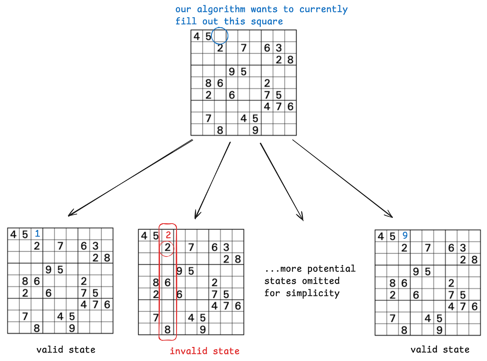
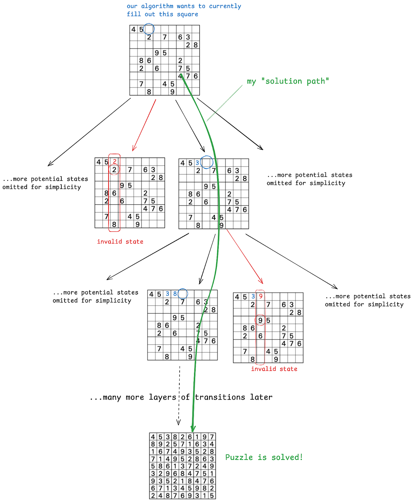
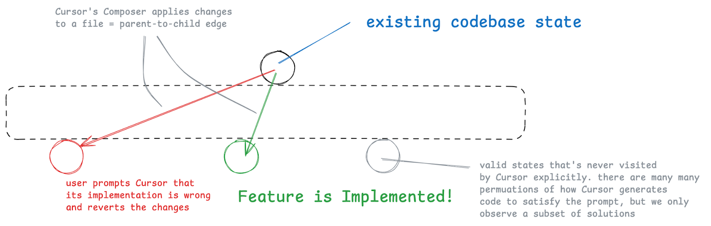
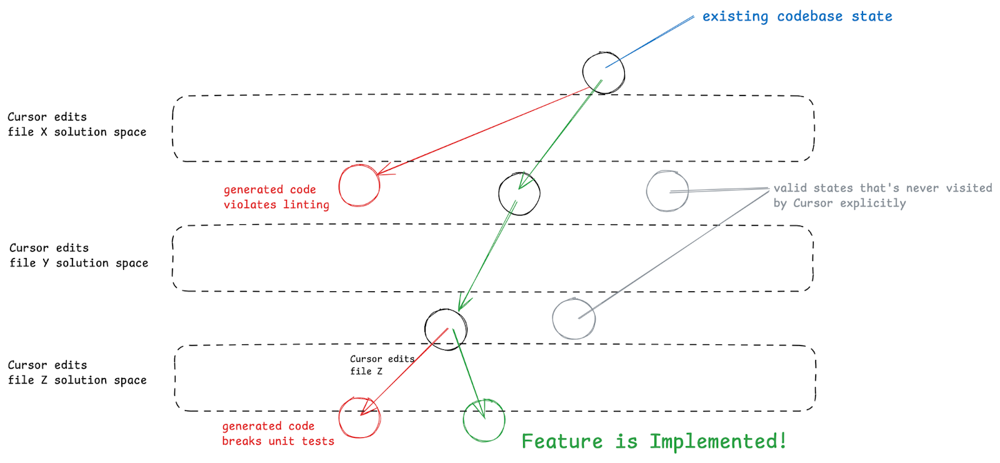
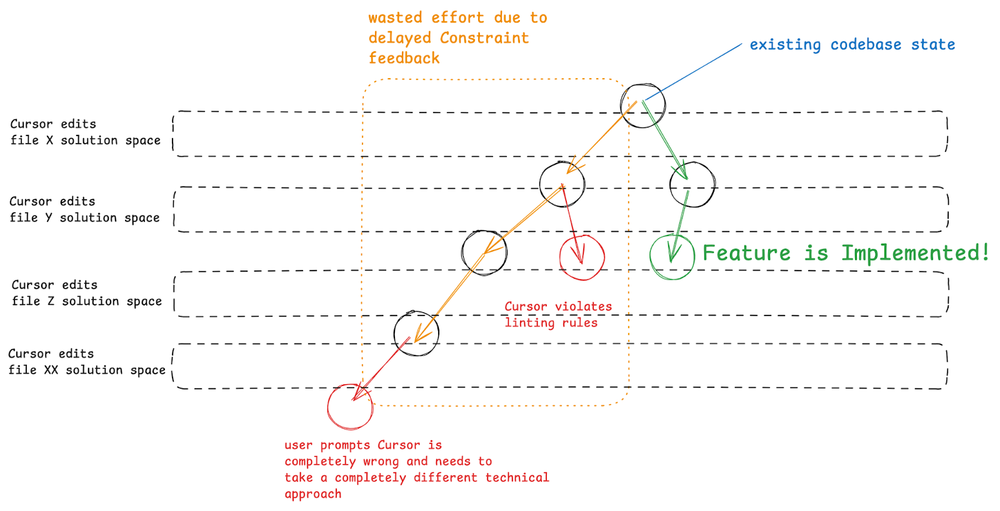
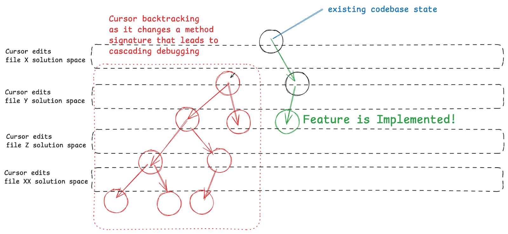

Hearing about someone on LinkedIn "Vibe Coding" a project together in a few hours or over a weekend feels pretty standard on LinkedIn these days. Tools like Cursor, Lovable, and bolt.new have eliminated the knowing-to-code-barrier to building software products, enabling even non-technical users to solo build impressive revenue-generating SaaS products. The standout feature of these products is their ability to generate code agentically: a user writes a single prompt and the product’s agent repeatedly writes code, checks its result, reads errors, writes fixes, and more -- all until the agent thinks it has completed its assigned prompt. Naturally, it feels like you can leave every decision to one of these AI tools and “Vibe Code” your way to a product without ever thinking about software architecture or even looking at a single line of code.

And for a while there, the zeitgeist online felt like people really started to believe we don’t need software engineers.

While “Vibe Coding” provides satisfying quick wins, they are slow death traps. Anyone who's worked on vibe coding projects long enough knows the pain when even LLMs can't reason through your new feature request.

There’s real value in using AI for code generation, but only when experienced software engineers partner with these tools to impart their software architecture and system design wisdom.

There’s plenty of articles out there on tactical advice on how to write `.cursorrules` or how to use Cursor in specific user-flow or Product Requirements Document workflows, but this article isn’t that. This is my attempt at sharing a mental model that’s served me well in building a large software product that’s based on fundamental Computer Science concepts.

## A Primer on Constraint Satisfaction Problems and Backtracking

If you've taken a Classical Artificial Intelligence course (e.g., [CS 440 at UIUC](https://mfleck.cs.illinois.edu/AI-course/index.html)) or have prepped for Leetcode style software engineering interviews, you've probably run into [Constraint Satisfaction Problems (CSPs)](<https://en.wikipedia.org/wiki/Constraint_satisfaction_problem#:~:text=Constraint%20satisfaction%20problems%20(CSPs)%20are,solved%20by%20constraint%20satisfaction%20methods>) or a family of algorithms that solve them called [Backtracking Algorithms](https://jeffe.cs.illinois.edu/teaching/algorithms/book/02-backtracking.pdf).

The big idea: what if we could borrow the same known high-level strategies for improving CSP solving algorithms to Agentic Coders like Cursor and Lovable? Would this help us deliver high-quality software while still shipping fast?

First, a primer on CSPs – a classic CSP problem is Sudoku; we're constrained by having each 3x3 section (tiled non-overlapping), each row, and each column containing all digits 1-9 with no repeats. Any Sudoku board that violates these constraints (eg. having numbers repeat in a section, col, or row) is Invalid. A Sudoku board filled in with valid numbers is finished.

We usually model CSPs with a Constraint Graph or Constraint Tree. Suppose we model the process of solving a Sudoku board as a 9-ary tree where our "current node" represents our existing Sudoku board state and each child of this node is each of the 1-9 numbers we can fill

Here's what the Constraint Tree looks like for a single step:

Above we can see that the second “leaf” in this tree is invalid, so when looking for a solution, our “path” wouldn’t pass through this invalid state/node.

Modeling our problem as a 9-ary tree, our finished state will be a leaf node in the tree and our algorithm's task is finding a path from root to leaf where all nodes in the path are valid states.

Here's a visual of navigating that Constraint Tree:

Here's [a full blog post](https://davidcarmel.org/2021/09/13/solving-sudoku-by-heuristic-search/) with the code for implementing the Sudoku backtracking algorithm and ways to improve its efficiency by introducing heuristics.

## Agentic Code Generation is a CSP Solver

Let's draw a parallel between how Cursor's Composer makes changes file by file to how we solve a Sudoku board square by square. Each transition to a child node represents Cursor’s Agent editing a file.

For tiny features where we only need to change a single file, this is what that process might look like. Even with small features Cursor might import an unintended library or make an undesirable implementation decision, we coach and mentor it through the problem, and it completes the feature.

But for larger features that touch multiple files, Cursor’s Composer does more work navigating this Constraint Tree.

For extremely open-ended feature requests, Cursor can go off and make undesirable changes that require the user restoring the original codebase state and adjusting the original prompt.

With smaller features and a lean codebase, Cursor and these other AI tools can usually intuit a plan for which files need to be edited and in what order with the right prompt. Our codebase naturally grows as we add more features which compounds with the accumulation of poor software architecture decisions from ‘vibing it out’. **As a result, Cursor will inevitably go into a death spiral: making file changes only to break linting in another file and repeating this cycle with wilder and wilder solutions as it tries to write hacks to quickly fix the problem.**

## Sustainable Agentic Code Generation

Framed with our Constraint Tree mental model, our codebase complexity directly increases the complexity of our Constraint Tree, increasing the difficulty Cursor’s Agent or lovable has in navigating the tree to implement a feature. The long-term result is our codebase having so much complexity that even these AI tools can't make progress.

We can apply the same intuition and patterns we use to optimize CSP/backtracking algorithms to think through better Agentic Code Generation.

Intuitively, we want to

- Reduce the search space of potential solutions Cursor or these other tools needs to search through
- Reduce the amount we backtrack by reducing the delay between when a file change is made and when Composer receives the feedback that we’re not on the correct solution path
- Reduce the number of files Cursor needs to edit to arrive at our solution (aka reduce the “height” of our CSP Tree) . This roughly maps to the good ol’ principle of building software with “low coupling and high cohesion”.
